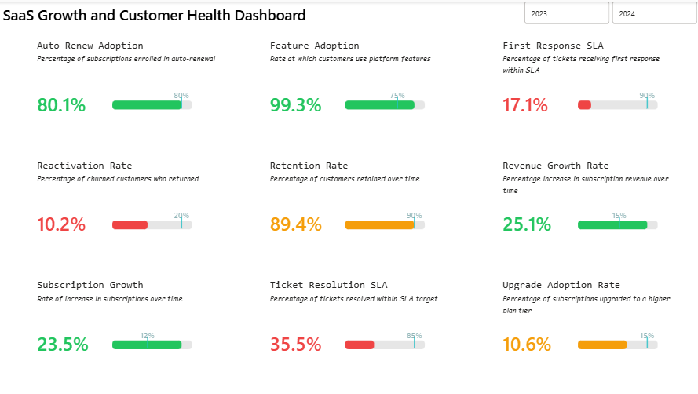

# SaaS-Performance-Intelligence

## Background & Overview

This project presents an executive-level SaaS performance dashboard built in Power BI to monitor business growth, customer retention, product adoption, and customer support effectiveness.

The objective was to design a centralized KPI monitoring solution that enables business leaders to quickly assess organizational performance against strategic targets and identify areas requiring intervention.

The dashboard combines subscription, customer lifecycle, feature usage, and support operations data into a single interactive reporting experience enhanced with dynamic KPI selection, target benchmarking, conditional formatting, and custom SVG-based KPI progress indicators.

---

## Dashboard Preview

---

## Data Structure Overview

The solution was built using five core datasets representing different stages of the SaaS customer lifecycle:

### fact_accounts
Contains customer account information including:

- Account details
- Industry
- Country
- Referral source
- Plan tier
- Trial status
- Customer churn status

Rows: 500

### fact_subscription
Contains subscription activity and revenue metrics including:

- Subscription lifecycle information
- Monthly recurring revenue (MRR)
- Annual recurring revenue (ARR)
- Upgrade and downgrade activity
- Auto-renewal behavior
- Customer churn indicators

Rows: 5,000

### fact_feature_usage
Tracks customer engagement and platform usage activity.

Rows: 25,000

### fact_support_tickets
Captures support operations including:

- Ticket response times
- Resolution times
- Escalation activity
- Customer satisfaction scores

Rows: 2,000

### fact_churn_events
Stores churn-related events including:

- Churn reasons
- Refund activity
- Upgrade and downgrade behavior before churn
- Customer reactivation activity

Rows: 600

### Disconnected Tables

#### KPI Selector: disconnected table used to switch between KPI measures dynamically.

| KPI | Description |
|---|---|
| Revenue | Percentage increase in subscription revenue over time |
| Subscription Growth | Rate of increase in subscription over time |
| Churn Rate | Percentage of customers lost during a period |
| Retention Rate | Percentage of customers retained over time |
| Feature Adoption | Percentage of customers actively using the platform features |
| Auto Renew Adoption | Percentage of subscriptions enrolled in auto-renewal |
| Ticket Resolution SLA | Percentage of tickets resolved within SLA target |
| Escalation Rate | Percentage of support tickets escalated for further handling |
| First Response SLA | Percentage of tickets receiving first response within SLA |

#### KPI Targets: disconnected table storing goal, mid, and red thresholds used for conditional formatting.

| KPI | Good Threshold | Mid Threshold | Red Threshold | Goal Value |
|---|---:|---:|---:|---:|
| Revenue Growth Rate | 0.15 | 0.09 | 0.04 | 0.15 |
| Auto Renew Adoption | 0.80 | 0.69 | 0.49 | 0.80 |
| Subscription Growth | 0.12 | 0.09 | 0.04 | 0.12 |
| Upgrade Adoption Rate | 0.15 | 0.09 | 0.04 | 0.15 |
| Retention Rate | 0.90 | 0.69 | 0.49 | 0.90 |
| Ticket Resolution SLA | 0.85 | 0.69 | 0.49 | 0.85 |
| Feature Adoption | 0.75 | 0.69 | 0.49 | 0.75 |
| Reactivation Rate | 0.20 | 0.14 | 0.09 | 0.20 |
| First Response SLA | 0.90 | 0.69 | 0.49 | 0.90 |
---

## Technical Stack

### Tools

- Power BI Desktop
- Power Query
- DAX

View the DAX measures [here](transformations/dax_for_SaaS_report.txt)

### Power BI Development Techniques

- Star-schema data modeling
- Dynamic KPI Selector Table
- Dynamic Measure Switching using `SWITCH()`
- `LOOKUPVALUE()`-based Target Benchmarking
- Conditional Formatting
- SVG-Based KPI Progress Bars
- Custom KPI Scorecard Design

---

## Business KPIs Tracked

| KPI | Actual | Target |
|---|---:|---:|
| Auto Renew Adoption | 80.1% | 80.0% |
| Feature Adoption | 99.3% | 75.0% |
| First Response SLA | 17.1% | 90.0% |
| Reactivation Rate | 10.2% | 20.0% |
| Retention Rate | 89.4% | 90.0% |
| Revenue Growth Rate | 25.1% | 15.0% |
| Subscription Growth | 23.5% | 12.0% |
| Ticket Resolution SLA | 35.5% | 85.0% |
| Upgrade Adoption Rate | 10.6% | 15.0% |

---

## Executive Summary

The SaaS business demonstrates strong growth performance and exceptional product adoption but faces significant operational challenges within customer support functions.

Feature adoption reached 99.3%, significantly exceeding the 75% target, indicating that customers actively engage with platform capabilities after subscription.

Revenue growth (25.1%) and subscription growth (23.5%) both exceeded their respective targets, suggesting strong market demand and successful customer acquisition efforts.

Customer retention remains healthy at 89.4%, narrowly missing the 90% target by less than one percentage point.

The primary performance gap exists within customer support operations. First Response SLA (17.1%) and Ticket Resolution SLA (35.5%) both fall substantially below target levels, indicating potential bottlenecks in customer service processes.

---

## Insights Deep Dive

### 1. Product Adoption Significantly Exceeds Expectations

Feature Adoption achieved 99.3% against a target of 75%.

This indicates that customers derive value from the platform shortly after onboarding and actively engage with available functionality.

### 2. Revenue Growth Outpaces Strategic Targets

Revenue Growth Rate reached 25.1%, exceeding the target of 15%.

The business is generating revenue growth approximately 67% above its target benchmark, demonstrating strong commercial performance.

### 3. Subscription Growth Remains Strong

Subscription Growth reached 23.5% compared to a target of 12%.

This suggests effective customer acquisition and continued expansion of the subscriber base.

### 4. Customer Retention Is Near Target

Retention Rate reached 89.4%, narrowly missing the 90% target.

While retention performance remains healthy, incremental improvements could have a significant impact on long-term recurring revenue.

### 5. Auto-Renew Adoption Meets Expectations

Auto Renew Adoption achieved 80.1%, slightly exceeding the 80% target.

High auto-renew participation supports revenue predictability and reduces involuntary churn risk.

### 6. Upgrade Adoption Remains an Opportunity Area

Upgrade Adoption Rate reached 10.6% against a target of 15%.

The gap suggests opportunities for improved upsell strategies and premium feature positioning.

### 7. Customer Recovery Efforts Need Improvement

Reactivation Rate reached only 10.2% versus a target of 20%.

This indicates that relatively few churned customers return after leaving the platform.

### 8. Support Operations Are the Largest Performance Risk

Ticket Resolution SLA achieved only 35.5% against an 85% target.

First Response SLA achieved only 17.1% against a 90% target.

These results indicate substantial inefficiencies in support response and resolution processes, creating potential risks to customer satisfaction and retention.

---

## Recommendations

### Improve Customer Support Performance

Review support staffing, ticket routing processes, and escalation procedures to improve both response and resolution SLAs.

### Strengthen Customer Retention Initiatives

Implement proactive customer success programs targeting accounts showing signs of disengagement before churn occurs.

### Increase Upsell Opportunities

Develop targeted upgrade campaigns based on customer usage behavior to improve plan migration rates.

### Expand Win-Back Programs

Introduce reactivation campaigns focused on churned customers to improve recovery performance.

### Leverage Strong Product Adoption

Use highly engaged customers as advocates for referrals, testimonials, and expansion opportunities.

### Sustain Growth Momentum

Continue investing in acquisition channels and onboarding experiences that are contributing to strong subscription and revenue growth.

---

## Key Takeaways

- Feature Adoption exceeded target by 24.3 percentage points.
- Revenue Growth exceeded target by 10.1 percentage points.
- Subscription Growth exceeded target by 11.5 percentage points.
- Auto Renew Adoption met target.
- Retention remained close to target.
- Upgrade Adoption and Reactivation Rate underperformed.
- Customer Support SLAs represent the largest operational improvement opportunity.
